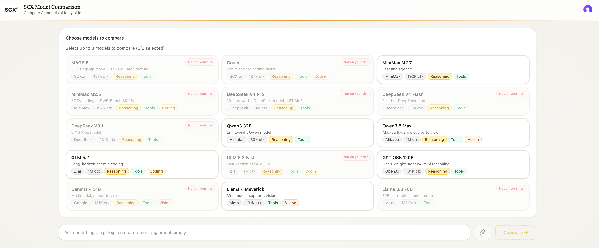

# SCX Model Comparison

Compare responses from multiple frontier AI models — side by side, in real time.

Built with **Next.js 14**, **TypeScript**, **Tailwind CSS**, and the [SCX.ai](https://scx.ai) API. Deployed on Vercel with Clerk authentication.

---

## Screenshots

### Landing Page


### App — Model Selector



---

## Features

- **Side-by-side streaming** — run one prompt across up to 3 models simultaneously; responses stream token by token over SSE
- **15 frontier models** — GPT OSS 120B, Llama 4 Maverick, Qwen3-32B, Qwen3.8-Max, GLM-5.2, MiniMax-M2.7, DeepSeek variants, and more
- **Reasoning trace** — models that think (Qwen3, MiniMax, GPT OSS) surface their chain-of-thought in a collapsible section
- **Vision input** — attach an image to compare how multimodal models interpret it differently
- **Response metrics** — time-to-first-token (ms) and token usage shown per panel
- **Model info badges** — provider, context window, and capability tags (Reasoning / Vision / Tools / Coding)
- **Tier awareness** — models outside the user's SCX.ai tier are clearly labeled
- **Mobile-ready** — horizontal snap scroll keeps all panels accessible on small screens
- **Clerk authentication** — invite-only access; API key stays server-side only

---

## Tech Stack

| Layer | Technology |
|-------|-----------|
| Framework | Next.js 14 (App Router) |
| Language | TypeScript |
| Styling | Tailwind CSS |
| Auth | Clerk v5 |
| API | SCX.ai — OpenAI-compatible (`/v1/chat/completions`) |
| Streaming | Edge Runtime + SSE |
| Deployment | Vercel |

---

## Project Structure

```
scx-project/
├── app/
│   ├── page.tsx               # Public landing/marketing page (/)
│   ├── compare/
│   │   └── page.tsx           # Protected comparison app (/compare)
│   ├── layout.tsx             # Root layout with ClerkProvider
│   ├── globals.css            # Fonts, background, animations
│   └── api/chat/route.ts      # Edge SSE route → SCX.ai API
├── components/
│   ├── ModelSelector.tsx      # Model grid with toggle logic
│   ├── ChatPanel.tsx          # Per-model streaming panel
│   └── ModelBadge.tsx         # Capability badge components
├── lib/
│   └── models.ts              # 15 model definitions + getModelById()
├── public/
│   ├── logo.png               # SCX logo
│   └── landing.png            # App screenshot used in hero section
└── middleware.ts              # Clerk middleware — protects /compare
```

---

## Getting Started

### Prerequisites

- Node.js 18+
- [SCX.ai](https://scx.ai) API key
- [Clerk](https://clerk.com) account

### Installation

```bash
git clone https://github.com/your-username/scx-project.git
cd scx-project
npm install
```

### Environment Variables

Create a `.env.local` file in the project root:

```env
SCX_API_KEY=your_scx_api_key

NEXT_PUBLIC_CLERK_PUBLISHABLE_KEY=pk_test_...
CLERK_SECRET_KEY=sk_test_...
NEXT_PUBLIC_CLERK_SIGN_IN_URL=/sign-in
NEXT_PUBLIC_CLERK_SIGN_UP_URL=/sign-up
NEXT_PUBLIC_CLERK_AFTER_SIGN_IN_URL=/compare
NEXT_PUBLIC_CLERK_AFTER_SIGN_UP_URL=/compare
```

### Run locally

```bash
npm run dev
# → http://localhost:3000
```

---

## Deployment (Vercel)

1. Push to GitHub and import the repo into [Vercel](https://vercel.com)
2. Add all environment variables from `.env.local` in the Vercel dashboard (use production Clerk keys)
3. In **Clerk Dashboard → Configure → Access mode**, set to **Invite-only** to control who can register
4. Add your Vercel domain to **Clerk Dashboard → Domains**

---

## Routes

| Route | Access | Description |
|-------|--------|-------------|
| `/` | Public | Marketing landing page |
| `/compare` | Protected (Clerk) | Main model comparison app |
| `/sign-in` | Public | Clerk sign-in page |
| `/sign-up` | Public | Clerk sign-up page |
| `/api/chat` | Protected | SSE streaming route to SCX.ai |
